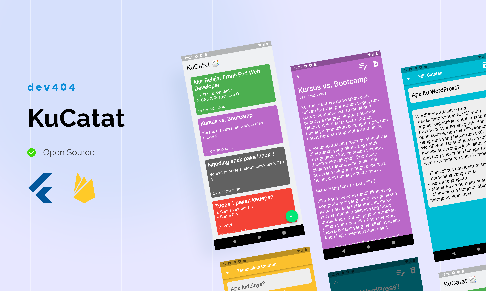

# KuCatat

Project aplikasi pencatatan android yang simpel. Dibuat menggunakan Flutter dan Firebase untuk menyimpan data. Aplikasi ini merupakan tugas submission Dicoding di kelas Belajar Membuat Aplikasi Flutter untuk Pemula. Aplikasi ini juga sudah responsif walau masih terdapat sedikit yang belum.
## Screenshots




## Demo

https://notes.dioo.my.id (old version)


## Run Locally

Clone the project

```bash
  git clone https://github.com/diorizqi404/ku-catat
```

Go to the project directory

```bash
  cd notes-dicoding
```

Get Packages

```bash
  flutter pub get
```

Run the app

```bash
  flutter run
  // In VSCode, u can use F5
```